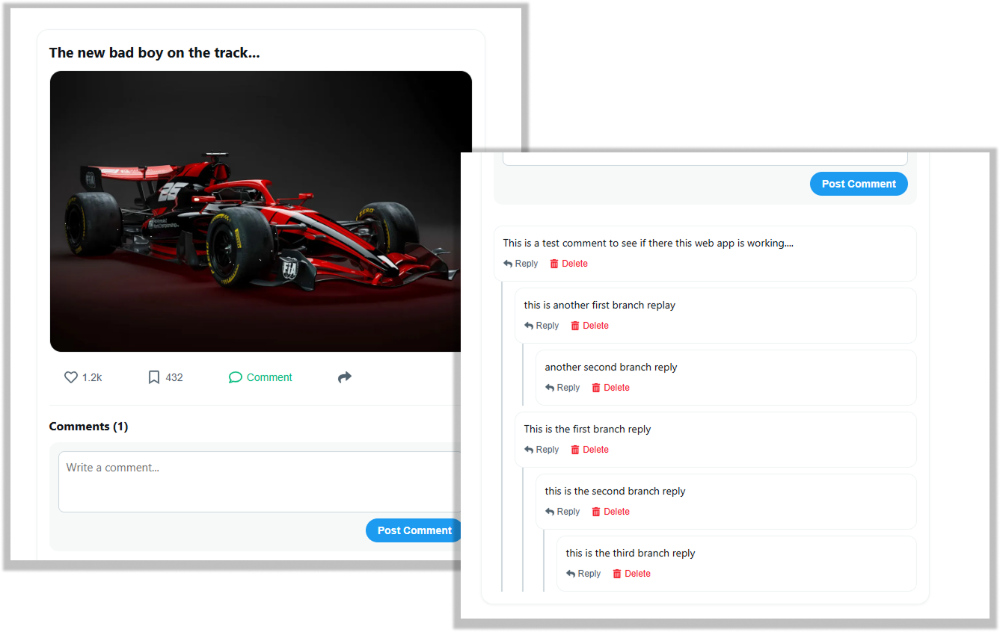

# r04-nested-comment-thread-1



An interactive, state-driven nested comment section built in React. This project demonstrates recursive component rendering, tree-structured state manipulation, and seamless user interaction for posting replies, editing comments, and deleting threads.

🔗 **[View Live Demo](https://nested-commment-section.netlify.app/)**

---

## 🚀 Features
* **Infinite Nesting Support:** Replies can be nested recursively, creating clear discussion threads.
* **CRUD Operations:** Users can add new comments, reply to existing threads, edit their posts, and delete comments.
* **Toggleable Threads:** Collapse or expand entire sub-threads for a cleaner user experience.
* **Responsive Styling:** Elegant tree-line indentation optimized for both desktop and mobile layouts.

## 🛠️ Tech Stack
* **Framework:** React 18+
* **Build Tool:** Vite
* **Styling:** CSS3 / Custom responsive layout
* **Hosting:** Netlify

---

## ⚛️ React Elements & Concepts in Use

This project utilizes advanced React concepts to manage hierarchical data structures and clean state updates:

* **Recursive Component Rendering:**
  * Uses a single `<Comment />` component that conditionally renders instances of itself inside its own body to display deeply nested replies without hardcoded limits.
* **Tree State Manipulation:**
  * Uses a centralized `useState` hook at the root to store comments as a nested tree object array.
  * Implements helper functions to recursively traverse, find, and update the nested tree structure whenever a node is added, edited, or deleted.
* **Conditional UI States:**
  * Manages toggling states for showing/hiding reply input fields, editing modes, and collapsing/expanding child components.
* **Component Composition:**
  * Keeps logic organized and modular by separating concerns between the main thread container, the individual comment nodes, and the reply input boxes.

---

## 💻 How to Run Locally

Since this project utilizes React and Vite, you will need Node.js installed on your computer to run it:

1. **Clone the repository:**
   ```bash
   git clone [https://github.com/shepherd-bit/r04-nested-comment-thread-1.git](https://github.com/shepherd-bit/r04-nested-comment-thread-1.git)